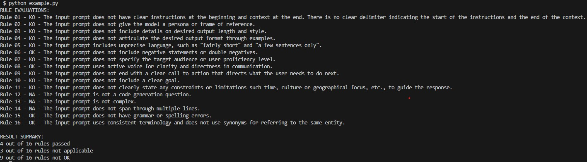

# Prompt Scorer

This repository contains the `prompt_scorer` module, a Python-based module for scoring system prompts against a set of prompt engineering best practices.


## Usage

The `example.py` script uses this module

```
# LLM client
llm_client = AzureOpenAI(azure_endpoint = AZURE_OPENAI_ENDPOINT, api_key = AZURE_OPENAI_API_KEY,  api_version = AZURE_OPENAI_API_VERSION)

# Sample input prompt
input_prompt = f"""The description for this product should be fairly short, a few sentences only, and not too much more."""

# Score the prompt calling the scoring function
prompt_scorer.score_prompt(input_prompt, llm_client, AZURE_OPENAI_MODEL_DEPLOYMENT_NAME)
```

